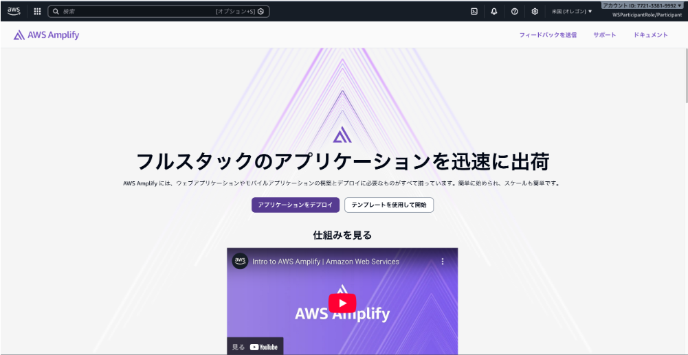
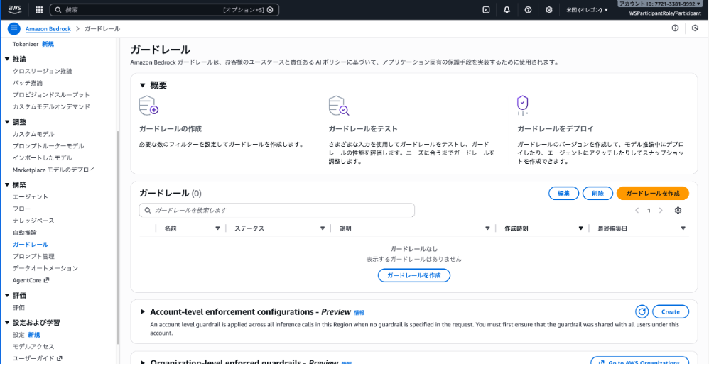

# はじめに
本ハンズオンで作成するアプリケーションのイメージは以下の通りです。


---

本ハンズオンでは下記の環境を構築します。


ハンズオンはオレゴンリージョン (us-west-2) を利用してください。


# フロントエンドファイルの内容

Web アプリケーションのインターフェイスになるフロントエンドの HTML ファイルについて内容を確認していきます。

ファイルの内容は以下の通りです。今回は時短のためにzip化したファイルを配布します。
（解凍すると以下のファイルが見えるかと思います）

```html
<!DOCTYPE html>
<html>

<head>
    <meta charset="UTF-8">
    <title>Amazon Bedrockサンプルアプリ</title>
    <script type="text/javascript" src="https://code.jquery.com/jquery-2.2.4.min.js"></script>

    <script type="text/javascript">
        $(function () {
            $("#response").html("Bedrockからの回答がここに表示されます");

            $("#button").click(function () {
                $("#response").html("Bedrockに問い合わせしています");
                var url = $("#apiUrl").val();
                var JSONdata = {
                    "key1": $("#text").val()
                };
                $.ajax({
                    type: 'post',
                    url: url,
                    data: JSON.stringify(JSONdata),
                    contentType: 'application/json',
                    dataType: 'json',
                    scriptCharset: 'utf-8',
                    success: function (data) {
                        $("#response").html(data);
                    },
                    error: function (data) {
                        // Error
                        alert("error");
                        alert(JSON.stringify(data));
                        $("#response").html(JSON.stringify(data));
                    }
                });
            })
        })
    </script>
</head>

<body>
    <h1>Amazon Bedrockサンプルアプリ</h1>
    <p>このアプリケーションは入力した文書に対して返事をしてくれます</p>
    <p>入力テキスト: <input type="text" id="text" size="100" placeholder="テキストを入力してください"></p>
    <p><button id="button" type="button">送信</button></p>
    <textarea id="response" cols=120 rows=10 disabled></textarea>
    <hr>
    <p>API URL: <input type="text" id="apiUrl" size="100"
            value="https://xxxxxxxxxx.execute-api.us-west-2.amazonaws.com/prod"></p>
</body>

</html>
```

いくつか重要なポイントに絞って解説していきます。まず、ファイルの末尾にある HTML の body 部分を確認していきます。

```
<body>
    <h1>Amazon Bedrockサンプルアプリ</h1>
    <p>このアプリケーションは入力した文書に対して返事をしてくれます</p>
    <p>入力テキスト: <input type="text" id="text" size="100" placeholder="テキストを入力してください"></p>
    <p><button id="button" type="button">送信</button></p>
    <textarea id="response" cols=120 rows=10 disabled></textarea>
    <hr>
    <p>API URL: <input type="text" id="apiUrl" size="100"
            value="https://xxxxxxxxxx.execute-api.us-west-2.amazonaws.com/prod"></p>
</body>
```

HTML本体はとてもシンプルなものです。入力テキストを書き込むテキストボックしの id が「text」、ボタンの id が「button」、レスポンスを書くテキストエリアの id が「response」となっています。こちらに入った内容を JavaScript(JQuery) の前半部分で処理していきます。その内容を見てみましょう。

```
$("#button").click(function () {
    $("#response").html("Bedrockに問い合わせしています");
    var url = $("#apiUrl").val();
    var JSONdata = {
        "key1": $("#text").val()
    };
```

JavaScriptでボタンが押されたときに関数を起動して、「text」に格納されている値を JSON データの「key1」という要素に変換します。後続の処理も見てみましょう。

```
$.ajax({
    type: 'post',
    url: url,
    data: JSON.stringify(JSONdata),
    contentType: 'application/json',
    dataType: 'json',
    scriptCharset: 'utf-8',
    success: function (data) {
        $("#response").html(data);
    },
    error: function (data) {
        // Error
        alert("error");
        alert(JSON.stringify(data));
        $("#response").html(JSON.stringify(data));
    }
});
```

後続処理では、指定した URL に前の手順で変換した JSON データを POST するという処理を実施します。POST がうまくいった場合に、送信先からの返り値(data)で response フィールドの内容が置き換えられます。

したがって、これから私たちは以下のものを作っていく必要があります。

- HTML ファイルをホストする Web サーバー（AWS Amplify の Amplify Hosting 機能を利用します）
- Bedrock に入力データを渡すプログラム（AWS Lambda で作成します）
- Web サーバーと Lambda 関数をつなぐ API Gateway

それでは、各コンポーネントを作っていきましょう。


# AWS Amplify への HTML ファイルアップロード

このハンズオンではAWS Amplifyを使ってWebサーバーの公開を行います。AWS Amplifyはモバイルアプリケーションを簡単にデプロイすることができるサービスで、Amplify HostingというWebサイトホスティング機能を有しています。こちらのサービスで簡単にフロントエンドファイルをWeb公開できます。 それでは、まずマネジメントコンソール上部の検索ボックスに「Amplify」と入力してAWS Amplifyのコンソールにアクセスしましょう。  


1. Amplify Consoleのトップ画面に遷移したら、「**アプリケーションをデプロイ**」ボタンを押します。  
    

2. アプリケーションの作成画面に遷移します。アプリケーションのデプロイ方法を選択する画面に移るので、「**Gitなしでデプロイ**」を選択し、「**次へ**」を押します。  
    

3. 手動デプロイ開始画面に遷移するので、アプリケーションの名前を「`SimpleBedrock`」と入力してブランチ名に「`main`」と入力します。そして、フロントエンドファイルとして作成した「`index.html`」ファイルをWindowsエクスプローラーやFinder上でZipファイル「`index.html.zip`」として圧縮して、画面下部のファイルアップロード領域にドラッグ&ドロップします。準備ができたら、「**保存してデプロイ**」ボタンを押します。  
    

4. デプロイ画面が表示されるのでしばらく待ちます。  
    

5. デプロイが完了するとURLが表示されますので、「**デプロイされたURLにアクセス**」ボタンを押し、HTML ファイルにアクセスできることを確認してください。確認できたら次のステップに進みます。  
    

6. まずはこの状態でテキストボックスに質問を入力し、挙動を見てみましょう。
	
	現状ではリクエストを受理するAPIが存在しないため、エラーが返ってくることがわかるかと思います。


# Bedrock ガードレールの設定
このセクションではBedrockのガードレールを設定していきます。

1. AWSコンソール上で左上の検索バーに「**Bedrock**」と入力し、検索します。
2. 画面左側のナビゲーションペインで「ガードレール」を選択し、「**ガードレールを作成**」を選択します。 
	

3. ガードレールを作成する画面に遷移します。名前に「`SimpleBedrockGuardrail`」と入力します。また「**Cross-Region inference - _optional_**」のタブを開き、「**Enable cross-Region inference for your guardrail**」のチェックを入れます。
   「次へ」を押します。
	
	**クロスリージョン推論とは**

	ガードレールでクロスリージョン推論を有効にすると、Amazon Bedrock Guardrails は、地理的に分散された複数のリージョン間でデータを安全に転送して処理します。これにより、需要の増加時にもガードレールのパフォーマンスと信頼性を維持できます。

4. コンテンツフィルターを設定する画面に遷移します。
   「`有害カテゴリのフィルターを有効にする`」をオンにします。また「**Content filters tier**」として「`Standard`」を選択します。「**スキップして確認および作成**」を押します。
	
5. 確認画面に遷移します。下までスクロールし、「**ガードレールを作成**」を押します。
	

6. これでガードレールが作成されました。続いてバージョンを作成します。
   「**バージョンを作成**」を押し、新しいバージョンを作成します。
   
   
7. ガードレールの概要画面で、英数字12桁のIDをコピー＆メモしておきます。
   
   これでガードレールの設定は完了です。


# Lambda関数の作成
このセクションでは、Amazon Bedrock を呼び出す Lambda 関数を作成します。以下にあるサンプルコードは Claude 3 Haiku / Sonnet を呼び出すシンプルな Python プログラムです。 AWS Lambdaにて動作させるファイルは以下のとおりです。

```python
import json
import boto3

def lambda_handler(event, context):
    # Bedrockクライアントを初期化
    bedrock = boto3.client(service_name='bedrock-runtime',
                           region_name='us-west-2')

    user_prompt = event["key1"]
    model_id = 'us.anthropic.claude-sonnet-4-5-20250929-v1:0'
    system_prompts = [{"text": "あなたは生成AIのエージェントです。ユーザからの質問に日本語で丁寧に回答してください。"}]

    messages = [
        {
            "role": "user",
            "content": [{"text": user_prompt}],
        }
    ]

    inferenceConfig = {
        "temperature": 0.1,
        "maxTokens": 3000,
        "stopSequences": []
    }

    # ガードレール設定（日本語対応版 - Standard tier）
    guardrail_id = "xxxxxxxxxxxx"  # 実際のIDに置き換え
    guardrail_version = "1"

    try:
        response = bedrock.converse(
            modelId=model_id,
            messages=messages,
            system=system_prompts,
            inferenceConfig=inferenceConfig,
            guardrailConfig={
                'guardrailIdentifier': guardrail_id,
                'guardrailVersion': guardrail_version
            }
        )

        return response["output"]["message"]["content"][0]["text"]

    except Exception as e:
        error_message = str(e)
        if 'GuardrailIntervened' in error_message or 'GUARDRAIL_INTERVENED' in error_message:
            return "申し訳ございません。この質問には回答できません。ガードレールによりブロックされました。"
        else:
            return f"エラーが発生しました: {error_message}"

```

コードの内容について解説します。

```python
def lambda_handler(event, context):
    user_prompt = event["key1"]
    model_id = 'us.anthropic.claude-sonnet-4-5-20250929-v1:0'
    system_prompts = [{"text": "あなたは生成AIのエージェントです。ユーザからの質問に日本語で丁寧に回答してください。"}]

    messages = [
        {
            "role": "user",
            "content": [{"text": user_prompt}],
        }
    ]

    inferenceConfig = {
        "temperature": 0.1,
        "maxTokens": 3000,
        "stopSequences":[]
    }

    response = bedrock.converse(
        modelId=model_id ,
        messages=messages,
        system=system_prompts,
        inferenceConfig=inferenceConfig
    )
```

このセクションでは、Amazon BedrockのConverse APIを使ってLambda関数の実行部分で利用するパラメータとレスポンスの形式を定義します。Lambdaに渡されるイベントデータの中にフロントエンドから渡されたユーザー入力メッセージがありますので、それをuser_prompt変数に格納し、user_message配列に入れてユーザープロンプトとします。model_idパラメーターでは利用する基盤モデルを指定します。利用したいモデルに応じて、モデルIDの値を書き換えます（このワークショップで利用できるモデルIDの一覧は[こちらのページ](https://catalog.us-east-1.prod.workshops.aws/workshops/0da6f9f4-c42f-4d47-90df-f89f4ab57e41/ja-JP/02-Bedrock/)を参照してください）。

また、システムプロンプトを設定したら、infernceConfigセクションにて出力の最大値、temparature（出力のランダム性）などのパラメーターを設定します。  さらにガードレールとして先ほど設定したガードレールのidとversionを指定しています。

これらの内容をbobedrock.converse配列に投入してLLMに引き渡し、レスポンスを引き出せるようにします。

```python
    return(response["output"]["message"]["content"][0]["text"])
```

レスポンスを受け取ります。レスポンスの中には本文テキストと付帯情報（レスポンスヘッダーなど）が混在しているため、本文部分だけピックアップして返り値に格納します。

```python
    except Exception as e:
        error_message = str(e)
        if 'GuardrailIntervened' in error_message or 'GUARDRAIL_INTERVENED' in error_message:
            return "申し訳ございません。この質問には回答できません。ガードレールによりブロックされました。"
        else:
            return f"エラーが発生しました: {error_message}"

```

また、例外処理としてガードレールの介入があった場合、それを検出してブロックされた旨のテキストを返します。
ガードレールの介入以外のエラーが返ってきた場合、エラーメッセージを返します。

このプログラムコードを、AWS Lambda に投入していきます。

1. マネジメントコンソールから AWS Lambda のコンソール画面を開き、画面右の「**関数を作成**」画面を押します。 

2. 「一から作成」メニューで、関数の名前は「`SimpleBedrock`」、ランタイムは「**Python3.14**」にして、「**関数の作成**」ボタンを押します。  
    

3. 関数が作成されますので、コード入力欄の既存のコードを削除し、上記のコード全文をコピー＆ペーストします。  
    
　

インデントの位置に気をつけてください。

4. `guardrail_id`のところを先ほどメモしたガードレールIDで置き換えます。変更が完了したら「**Deploy**」ボタンを押して変更を反映します。

5. Lambda 関数はタイムアウト時間が初期状態だと3秒に設定されており、言語モデルの推論に間に合わないためこの時間を延長します。「設定」タブの「一般設定」メニューの「**編集**」ボタンを押します。  
    

6. タイムアウト値を「1分以上」に設定して、「**保存**」ボタンを押します。  
    

7. また、IAM ロールには Amazon Bedrock を呼び出す権限がまだついていないので付与する必要があります。同じ設定タブの「アクセス権限」を開き、ロール名のリンクをクリックすると IAM ロールの編集画面に遷移しますので、「**許可を追加**」ボタンから「**ポリシーをアタッチ**」を押し、ポリシー追加画面を開きます。ポリシー追加画面では検索ボックスに「Bedrock」と入力して絞り込み、**AmazonBedrockFullAccess**ポリシーにチェックを入れて、「**許可を追加**」ボタンを押します。  
    
　 

8. ここまで設定できたらプログラム実行の準備が整いました。コード画面に戻り、「Test」ボタンを押すとテストイベントの編集画面が出てきます。「イベント名」に「`Test`」などと入れます。イベントテンプレートは初期状態で出てくる「hello-world」テンプレートを使います。「key1」要素の右にある「`value1`」という文字列を任意の質問で書き換えてください（ダブルクォーテーションを消さないように注意しましょう）。他は残しておいて大丈夫ですので、「**保存**」ボタンを押します。  
    

9. 保存できたら再度「Test」ボタンを押しましょう。テスト結果画面の「Response」に問いかけへの回答が表示されたら成功です！  
    


# API Gateway の作成
クライアント（HTML ファイル）と Lambda 関数をつなぐインターフェイスとして、API Gateway を立ち上げます。

1. AWS マネジメントコンソールのトップ画面上部の検索ボックスにて「`API`」で検索を行い、**API Gateway** をクリックします  
    
    

2. 画面は下方までスクロールし、**REST API**の**構築**をクリックします  
    
    
3. REST APIの設定をしていきます。  
    **新しいAPI**をクリックし、**API名**に`SimpleBedrockAPI`と入力し、**APIを作成**をクリックします。  
    
    
4. APIのメソッドを作成します。**メソッドを作成**をクリックしてください。  
    
    
5. **メソッドタイプ**に**POST**を選択し、**統合タイプ**には**Lambda 関数**を選びます。  
    
    

6. 下にスクロールし、Lambda 関数を指定します。入力補完が有効なので、`SimpleBedrock`と入力すると一つ前の章で作成したLambda 関数が表示されます。関数名が入力できたら**メソッドを作成**をクリックしてください。  


7. このAPIのリソースの設定をしていきます。定義したPOSTメソッドの上にある **/** をクリックし移動します。  
    
    

8. **CORS を有効にする**をクリックし、CORSの設定をしていきます。  
    
    

**CORS とは？**

クロスオリジンリソース共有 (CORS) は、アプリケーションを統合するためのメカニズムです。CORS は、ウェブブラウザが異なるドメインからリソースを安全に共有できるようにするためのメカニズムです。特定のドメインにロードされたクライアントウェブアプリケーションが異なるドメイン内のリソースと通信する方法を定義します。複雑なアプリケーションはクライアント側のコードでサードパーティーの API やリソースを参照することが多いため、CORS が役立ちます。

9. **POST**にチェックをいれ、**保存**をクリックします。  
    
    

10. APIの設定が完了したので、デプロイを行います。**API をデプロイ**をクリックします。 
    
11. **ステージ**に**新しいステージ**を選び、**ステージ名**に`prod`と入力し、**デプロイ**をクリックします。 
    
12. APIのURLが生成されるので、画面中部のURLをコピーして控えます。
    
    
13. 先ほどのウェブアプリの画面に戻り、画面下部の`API URL`のテキストボックスにAPI GatewayのURLをペーストします。
    


**APIのセキュリティ設定について**

このワークショップではサンプルアプリケーションの作成なのでシンプルな構成にしていますが。本番アプリケーションにはCognitoオーソライザーやLambdaオーソライザーなどによる認証・認可のプロセスを入れるようにしましょう。認証・認可をAPI Gateway利用時に必須にすることでAPIの不正利用による課金増を防ぐことができます。


14. 表示されたWebページからBedrockへ質問をしてみましょう。**入力テキスト**に質問を入力し、**送信**をクリックします。  
	回答が返ってきたらハンズオン成功です！  
	


# RAGアプリケーションの作成

1. Amazon S3のコンソールに移動し、画面に表示される「バケットを作成」ボタンを押します。  


2. 任意の名前を入力して、他の設定は編集せずに画面最下部の「バケットを作成」ボタンを押します。  
   （バケットの名前は全世界で一意である必要があります。）
    
    
3. バケットが作成されます。このバケットをナレッジベース作成のために使います。  
    
    
4. Amazon Bedrockのコンソールに移動し、左側のメニューの「オーケストレーション」内の「ナレッジベース」をクリックします。  
    
    
5. 画面下部に移動し、「ナレッジベース」メニューから「**作成**」ボタンを押してポップアップから「**ベクトルストアを含むナレッジベース**」を選択します。  
    
    
6. ナレッジベース詳細画面に遷移します。ステップ1の画面は何も設定を変更する必要がありませんので、そのまま画面最下部の「**次へ**」ボタンをクリックします。  
    
    
7. データソースの設定画面に遷移します。ここでデータソースに使うS3バケットを選択します。「**Browse S3**」ボタンを押します。  
    
    
8. S3バケットの一覧が表示されますので、先ほど作成したバケットを選択します。  
    
    
9. バケットがセットされたら「次へ」ボタンを押します。  
    
    

10. 埋め込みモデルとベクトルストアの設定画面に遷移します。「**埋め込みモデル**」ボタンを押して埋め込みモデル選択画面を開き、「`Titan Text Embeddings V2`」を選択します。  


  


11. ベクトルデータベースは「新しいベクトルストアをクイック作成」を選択し、「`Amazon OpenSearch Serverless`」が選択されていることを確認して「**次へ**」ボタンを押します。  
    
    
12. 設定を確認して「**ナレッジベースを作成**」ボタンを押します。**ナレッジベースの作成中に他の画面に遷移すると作成プロセスが中断されてしまいますので、絶対に他の画面に遷移しないようにしましょう。**  
    
    
13. ナレッジベースが作成できましたが、現在はファイルが存在しません。そこでAmazon S3バケットにファイルをアップロードします。S3コンソールでナレッジベースに紐づけたバケットを開き、「**アップロード**」ボタンを押します。  
    
    

14. サンプルファイルとして、**架空のドラム式洗濯機のサービスマニュアル**を用意しました。ローカル環境にダウンロードした後ドラッグ＆ドロップして「**アップロード**」ボタンを押します。  


15. アップロードが完了したら「**閉じる**」ボタンを押して終了します。  
    
    
16. 先ほど作成したナレッジベースの画面に戻り、画面下部にある「データソース」セクションを見るとデータソースが一つ作られているのでラジオボタンをクリックしてチェックを入れて「**同期**」ボタンを押します。  
    
    
17. しばらく待つと同期が完了し、「最終同期時刻」が表示されたら成功です。 
    

18. 同期が成功したらテストです。「**モデルを選択**」ボタンを押して利用したいモデルを選択し、「**適用**」ボタンを押したらナレッジベースに記載されている内容についてメッセージ入力欄に入力して「**実行**」ボタンを押してみましょう（下の画像ではClaude 3 Haikuを利用した例を示しています）。 
19. 作成したナレッジベースの「ナレッジベースID」をコピーしメモしておきます。

20. 続いて、ナレッジベースを参照するようLambdaのコードを以下のように編集しデプロイします。
    YOUR_KNOWLEDGE_BASE_IDを先ほどメモしたナレッジベースIDに置き換えてください。

```python
import json
import boto3

def lambda_handler(event, context):
    # Bedrockクライアントを初期化
    bedrock_agent = boto3.client(service_name='bedrock-agent-runtime', region_name='us-west-2')
    
    user_query = event["key1"]
    
    # ナレッジベースID（実際のIDに置き換え）
    knowledge_base_id = "YOUR_KNOWLEDGE_BASE_ID"
    
    # モデルARN
    model_arn = "us.anthropic.claude-sonnet-4-5-20250929-v1:0"
    
    try:
        # RetrieveAndGenerate APIを使用
        response = bedrock_agent.retrieve_and_generate(
            input={
                'text': user_query
            },
            retrieveAndGenerateConfiguration={
                'type': 'KNOWLEDGE_BASE',
                'knowledgeBaseConfiguration': {
                    'knowledgeBaseId': knowledge_base_id,
                    'modelArn': model_arn
                }
            }
        )
        
        # 回答を取得
        answer = response['output']['text']
        
        # 参照元の情報を追加（オプション）
        citations = response.get('citations', [])
        if citations:
            answer += "\n\n【参照元】\n"
            for i, citation in enumerate(citations, 1):
                references = citation.get('retrievedReferences', [])
                for ref in references:
                    location = ref.get('location', {})
                    s3_location = location.get('s3Location', {})
                    uri = s3_location.get('uri', '')
                    if uri:
                        answer += f"{i}. {uri}\n"
        
        return answer
        
    except Exception as e:
        error_message = str(e)
        return f"エラーが発生しました: {error_message}"

```

21. この状態でサンプルアプリのWebページに戻り、ナレッジベースの内容を取得した上で応答できるか試してみましょう。
    
    例：「顧客から乾燥が不十分になってきたとのことで修理依頼を受けた。修理手順を説明して。」
    「DW-X9000の社内問い合わせ先はどこ？」
